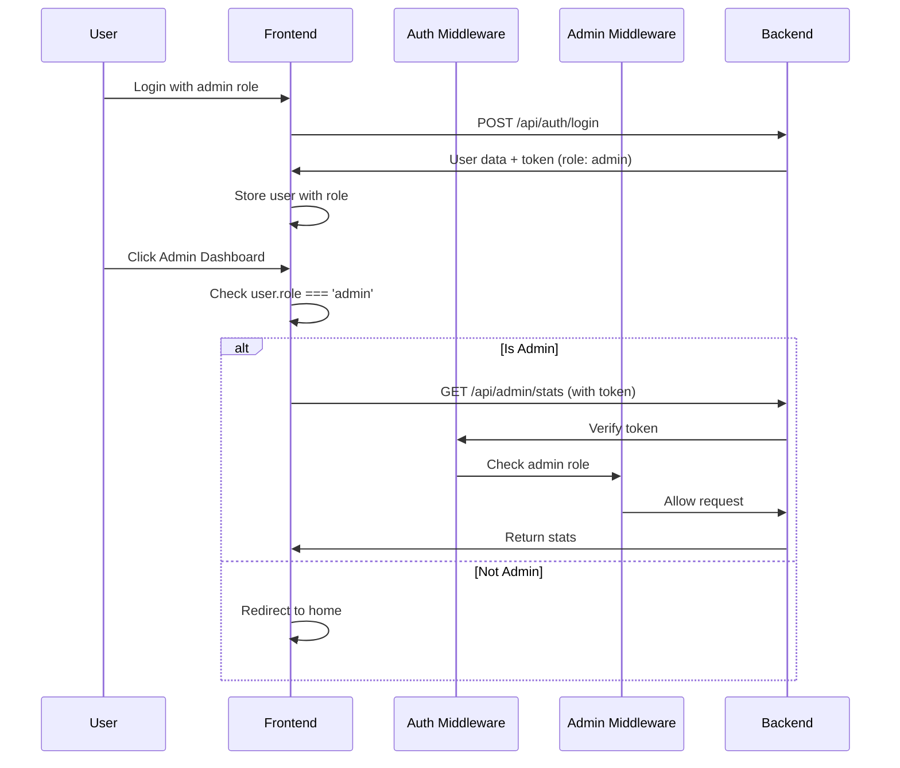
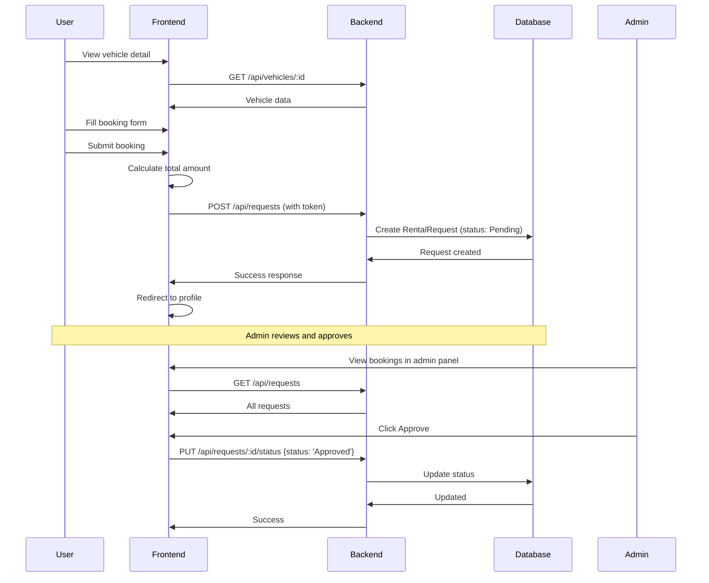

# Design Document - Admin Dashboard & Booking System

## Overview

This design implements a complete admin dashboard with role-based access control, vehicle management, booking request handling, and user management. Regular users get a booking interface to request vehicle rentals. The system uses the existing black/white/grey color scheme and professional icons instead of emojis.

## Architecture

### High-Level Architecture

```
┌─────────────────────────────────────────────────────────────┐
│                     Frontend (React)                        │
├───────────────────┬─────────────────┬──────────────────────┤
│   Admin Routes    │   User Routes   │   Public Routes       │
│   - Dashboard     │   - Profile     │   - Home             │
│   - Vehicles CRUD │   - My Bookings │   - Fleet Browse     │
│   - Bookings Mgmt │   - Book Vehicle│   - Auth             │
│   - Users Mgmt    │                 │                       │
│   - Categories    │                 │                       │
└───────────────────┴─────────────────┴──────────────────────┘
                            │
                            │ HTTP/JSON + JWT
                            ▼
┌─────────────────────────────────────────────────────────────┐
│                  Backend API (Express)                       │
├──────────────────┬──────────────────┬──────────────────────┤
│  Auth Middleware │  Admin Middleware│  Public Endpoints    │
└──────────────────┴──────────────────┴──────────────────────┘
                            │
                            ▼
┌─────────────────────────────────────────────────────────────┐
│                     MongoDB Database                         │
│  Collections: Users, Vehicles, Categories, RentalRequests   │
└─────────────────────────────────────────────────────────────┘
```

## Components and Interfaces

### Backend API Endpoints

#### Admin Endpoints (Requires Admin Role)

1. **GET /api/admin/stats**
   - Returns dashboard statistics
   - Response: `{ totalUsers, totalVehicles, totalBookings, totalRevenue }`

2. **GET /api/admin/users**
   - Returns all users
   - Response: Array of user objects (password excluded)

3. **PUT /api/admin/users/:id/role**
   - Updates user role
   - Body: `{ role: 'admin' | 'user' }`

4. **GET /api/requests** (Admin view)
   - Returns all booking requests
   - Populated with user and vehicle details

5. **PUT /api/requests/:id/status**
   - Updates booking status
   - Body: `{ status: 'Approved' | 'Rejected' | 'Completed' | 'Cancelled' }`

6. **POST /api/vehicles**
   - Creates new vehicle
   - Body: Vehicle data

7. **PUT /api/vehicles/:id**
   - Updates vehicle
   - Body: Updated vehicle data

8. **DELETE /api/vehicles/:id**
   - Deletes vehicle

9. **POST /api/categories**
   - Creates new category
   - Body: `{ name, description }`

10. **PUT /api/categories/:id**
    - Updates category

#### User Endpoints (Requires Authentication)

1. **GET /api/requests/my**
   - Returns logged-in user's booking requests

2. **POST /api/requests**
   - Creates booking request
   - Body: `{ vehicleId, startDate, endDate, pickupLocation, returnLocation, additionalNotes }`

3. **PUT /api/requests/:id/cancel**
   - Cancels user's own pending request

#### Public Endpoints

1. **GET /api/vehicles**
   - Returns all vehicles

2. **GET /api/vehicles/:id**
   - Returns single vehicle details

3. **GET /api/categories**
   - Returns all categories

### Frontend Component Structure

```
src/
├── admin/
│   ├── Dashboard.jsx        (UPDATE: Real stats from API)
│   ├── Dashboard.css         (UPDATE: Remove emojis, professional icons)
│   ├── VehicleManagement.jsx (NEW: CRUD for vehicles)
│   ├── BookingManagement.jsx (NEW: Approve/reject bookings)
│   ├── UserManagement.jsx    (NEW: View/manage users)
│   └── CategoryManagement.jsx(NEW: Manage categories)
├── pages/
│   ├── Fleet.jsx            (UPDATE: Real data from API)
│   ├── VehicleDetail.jsx    (NEW: Vehicle details + booking form)
│   └── Profile.jsx          (UPDATE: Show real bookings)
├── components/
│   ├── AdminRoute.jsx       (NEW: Route guard for admins)
│   ├── BookingForm.jsx      (NEW: Form for booking requests)
│   └── Navbar.jsx           (UPDATE: Show admin link for admins)
└── utils/
    └── api.js               (UPDATE: Add admin/booking APIs)
```

## Data Models

### User Model (Already Exists - No Changes)
```javascript
{
  name: String,
  email: String,
  password: String (hashed),
  phone: String,
  role: String (enum: ['user', 'admin']), // Used for RBAC
  createdAt: Date,
  updatedAt: Date
}
```

### Vehicle Model (Already Exists - No Changes)
```javascript
{
  name: String,
  category: ObjectId (ref: Category),
  brand: String,
  image: String (URL),
  description: String,
  pricePerDay: Number,
  availability: Boolean,
  location: String,
  createdAt: Date,
  updatedAt: Date
}
```

### RentalRequest Model (Already Exists - No Changes)
```javascript
{
  userId: ObjectId (ref: User),
  vehicleId: ObjectId (ref: Vehicle),
  startDate: Date,
  endDate: Date,
  totalAmount: Number,
  status: String (enum: ['Pending', 'Approved', 'Rejected', 'Completed', 'Cancelled']),
  pickupLocation: String,
  returnLocation: String,
  additionalNotes: String,
  createdAt: Date,
  updatedAt: Date
}
```

### Category Model (Already Exists)
```javascript
{
  name: String,
  description: String,
  createdAt: Date,
  updatedAt: Date
}
```

## User Interface Design

### Admin Dashboard Layout

```
┌─────────────────────────────────────────────────────────┐
│  NAVBAR (with ADMIN link visible for admins)            │
├─────────────┬───────────────────────────────────────────┤
│  SIDEBAR    │  MAIN CONTENT                             │
│             │                                            │
│ Dashboard   │  ┌──────────────────────────────────────┐ │
│ Vehicles    │  │  Statistics Cards (4 cards)          │ │
│ Bookings    │  │  • Total Users                       │ │
│ Users       │  │  • Total Vehicles                    │ │
│ Categories  │  │  • Total Bookings                    │ │
│             │  │  • Total Revenue                     │ │
│ Back to Site│  └──────────────────────────────────────┘ │
│             │                                            │
│             │  ┌──────────────────────────────────────┐ │
│             │  │  Recent Bookings Table               │ │
│             │  │  [Approve] [Reject] actions          │ │
│             │  └──────────────────────────────────────┘ │
└─────────────┴───────────────────────────────────────────┘
```

### Vehicle Detail + Booking Form (User View)

```
┌─────────────────────────────────────────────────────────┐
│  Vehicle Image (large)                                   │
├─────────────────────────────────────────────────────────┤
│  Vehicle Name - Brand                                    │
│  ₹ Price per day                                         │
│  Location: City                                          │
│  Status: Available / Not Available                       │
│                                                          │
│  Description text...                                     │
│                                                          │
│  ┌─────────────────────────────────────────────────┐   │
│  │  BOOKING FORM                                    │   │
│  │  Start Date: [date picker]                       │   │
│  │  End Date: [date picker]                         │   │
│  │  Pickup Location: [input]                        │   │
│  │  Return Location: [input]                        │   │
│  │  Additional Notes: [textarea]                    │   │
│  │                                                   │   │
│  │  Total Amount: ₹ X,XXX (calculated)              │   │
│  │  [SUBMIT BOOKING REQUEST]                        │   │
│  └─────────────────────────────────────────────────┘   │
└─────────────────────────────────────────────────────────┘
```

### User Profile - My Bookings Section

```
┌─────────────────────────────────────────────────────────┐
│  MY BOOKINGS                                             │
├─────────────────────────────────────────────────────────┤
│  ┌─────────────────────────────────────────────────┐   │
│  │  REQ001 - BMW X5                                 │   │
│  │  10 Oct 2026 - 12 Oct 2026                       │   │
│  │  Amount: ₹15,000                                 │   │
│  │  Status: PENDING (yellow)    [Cancel]           │   │
│  └─────────────────────────────────────────────────┘   │
│                                                          │
│  ┌─────────────────────────────────────────────────┐   │
│  │  REQ002 - Toyota Innova                          │   │
│  │  15 Oct 2026 - 18 Oct 2026                       │   │
│  │  Amount: ₹9,000                                  │   │
│  │  Status: APPROVED (green)                        │   │
│  └─────────────────────────────────────────────────┘   │
└─────────────────────────────────────────────────────────┘
```

## Icon Strategy (No Emojis)

Replace all emoji icons with professional alternatives:

### Option 1: React Icons (lucide-react)
```bash
npm install lucide-react
```

Icon mapping:
- Dashboard: `<LayoutDashboard />`
- Vehicles: `<Car />`
- Users: `<Users />`
- Bookings: `<FileText />`
- Categories: `<FolderTree />`
- Money: `<DollarSign />`
- Back: `<ArrowLeft />`

### Option 2: SVG Icons (Inline)
Use inline SVG for lightweight approach

### Implementation
```jsx
import { Car, Users, FileText, DollarSign } from 'lucide-react';

<div className="stat-card">
  <Car className="stat-icon" />
  <div className="stat-number">35</div>
  <div className="stat-label">Total Vehicles</div>
</div>
```

## Authentication & Authorization Flow

### Admin Access Flow



### Booking Flow



## Role-Based Access Control (RBAC)

### Backend Middleware

```javascript
// middleware/authMiddleware.js (EXISTING - already has protect)

// NEW: Add admin middleware
export const admin = (req, res, next) => {
  if (req.user && req.user.role === 'admin') {
    next();
  } else {
    res.status(403).json({ message: 'Access denied. Admin only.' });
  }
};
```

### Route Protection

```javascript
// Admin-only routes
router.get('/admin/stats', protect, admin, getAdminStats);
router.get('/admin/users', protect, admin, getAllUsers);
router.put('/admin/users/:id/role', protect, admin, updateUserRole);
router.put('/requests/:id/status', protect, admin, updateRequestStatus);
router.post('/vehicles', protect, admin, createVehicle);
router.put('/vehicles/:id', protect, admin, updateVehicle);
router.delete('/vehicles/:id', protect, admin, deleteVehicle);

// User routes
router.get('/requests/my', protect, getMyRequests);
router.post('/requests', protect, createRequest);
router.put('/requests/:id/cancel', protect, cancelRequest);

// Public routes
router.get('/vehicles', getVehicles);
router.get('/vehicles/:id', getVehicleById);
```

### Frontend Route Protection

```jsx
// AdminRoute.jsx (NEW)
import { Navigate } from 'react-router-dom';
import { useAuth } from '../context/AuthContext';

function AdminRoute({ children }) {
  const { user, loading } = useAuth();

  if (loading) return <div>Loading...</div>;
  if (!user || user.role !== 'admin') {
    return <Navigate to="/" replace />;
  }

  return children;
}
```

## Styling Guidelines (Black/White/Grey Theme)

### Color Palette (Already Defined)
```css
--black: #111111
--white: #FFFFFF
--dudhiya: #F4F1E8
--light-grey: #E8E8E8
--dark-grey: #555555
```

### Status Colors
```css
--status-pending: #FDB022  /* Yellow/Gold */
--status-approved: #28A745 /* Green */
--status-rejected: #DC3545 /* Red */
--status-completed: #6C757D /* Grey */
--status-cancelled: #6C757D /* Grey */
```

### Admin Dashboard Specific
```css
.admin-sidebar {
  background: var(--black);
  color: var(--white);
}

.admin-sidebar-item {
  border-left: 3px solid transparent;
}

.admin-sidebar-item.active {
  background: rgba(255, 255, 255, 0.1);
  border-left-color: var(--dudhiya);
}

.stat-card {
  background: var(--white);
  border: 1px solid var(--light-grey);
}

.stat-icon {
  color: var(--dark-grey);
  width: 32px;
  height: 32px;
}
```

## Error Handling

### Backend Errors

1. **403 Forbidden** - User tries admin endpoint without admin role
2. **404 Not Found** - Vehicle/Request/User not found
3. **400 Bad Request** - Invalid booking dates, missing required fields
4. **409 Conflict** - Vehicle not available for selected dates

### Frontend Error Handling

1. **Network Errors** - Show toast: "Unable to connect"
2. **Permission Denied** - Redirect to home with message
3. **Validation Errors** - Show inline field errors
4. **Booking Conflicts** - Show "Vehicle not available for these dates"

## Testing Strategy

### Manual Testing Checklist

**Admin Functions:**
- [ ] Admin user sees ADMIN link in navbar
- [ ] Regular user doesn't see ADMIN link
- [ ] Admin can access dashboard with real stats
- [ ] Admin can view all bookings
- [ ] Admin can approve/reject bookings
- [ ] Admin can create/edit/delete vehicles
- [ ] Admin can view all users
- [ ] Admin can change user roles
- [ ] Non-admin redirected from admin routes

**User Booking Functions:**
- [ ] User can view vehicle list
- [ ] User can view vehicle details
- [ ] User can submit booking request
- [ ] Total amount calculates correctly
- [ ] User sees booking in profile
- [ ] User can cancel pending booking
- [ ] Approved bookings can't be cancelled
- [ ] Status colors display correctly

**Edge Cases:**
- [ ] Booking past dates validation
- [ ] End date before start date validation
- [ ] Can't delete vehicle with active bookings
- [ ] Can't demote last admin user
- [ ] Token expiration handling

## Implementation Priority

### Phase 1: Backend Routes & Middleware
1. Add admin middleware
2. Create admin stats endpoint
3. Add booking endpoints
4. Add user management endpoints
5. Protect routes with admin middleware

### Phase 2: Frontend Admin Dashboard
1. Install lucide-react icons
2. Update Dashboard.jsx with real data
3. Create VehicleManagement component
4. Create BookingManagement component
5. Create UserManagement component
6. Create AdminRoute wrapper
7. Update routing in App.jsx

### Phase 3: Frontend User Booking
1. Create VehicleDetail page
2. Create BookingForm component
3. Update Profile to show bookings
4. Add booking API calls
5. Implement cancel functionality

### Phase 4: Polish & Testing
1. Remove all emojis, replace with icons
2. Test all admin functions
3. Test all user booking flows
4. Test role-based access
5. Fix styling issues

## Security Considerations

1. **Role Verification**: Always verify role on backend, never trust frontend
2. **Token Validation**: All admin/user endpoints require valid JWT
3. **Input Sanitization**: Validate all booking dates and amounts
4. **SQL Injection Protection**: Mongoose handles this
5. **XSS Protection**: React escapes by default
6. **CSRF**: Not needed for JWT-based auth

## Future Enhancements (Out of Scope)

- Payment gateway integration
- Vehicle availability calendar
- Booking confirmation emails
- Invoice generation
- Rating and review system
- Real-time notifications
- Vehicle image upload
- Advanced search and filters
