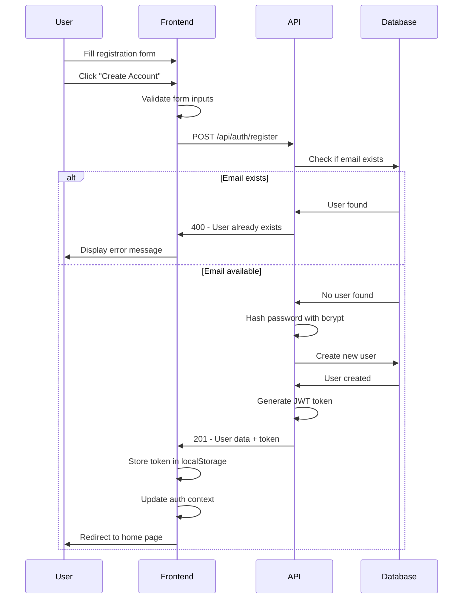
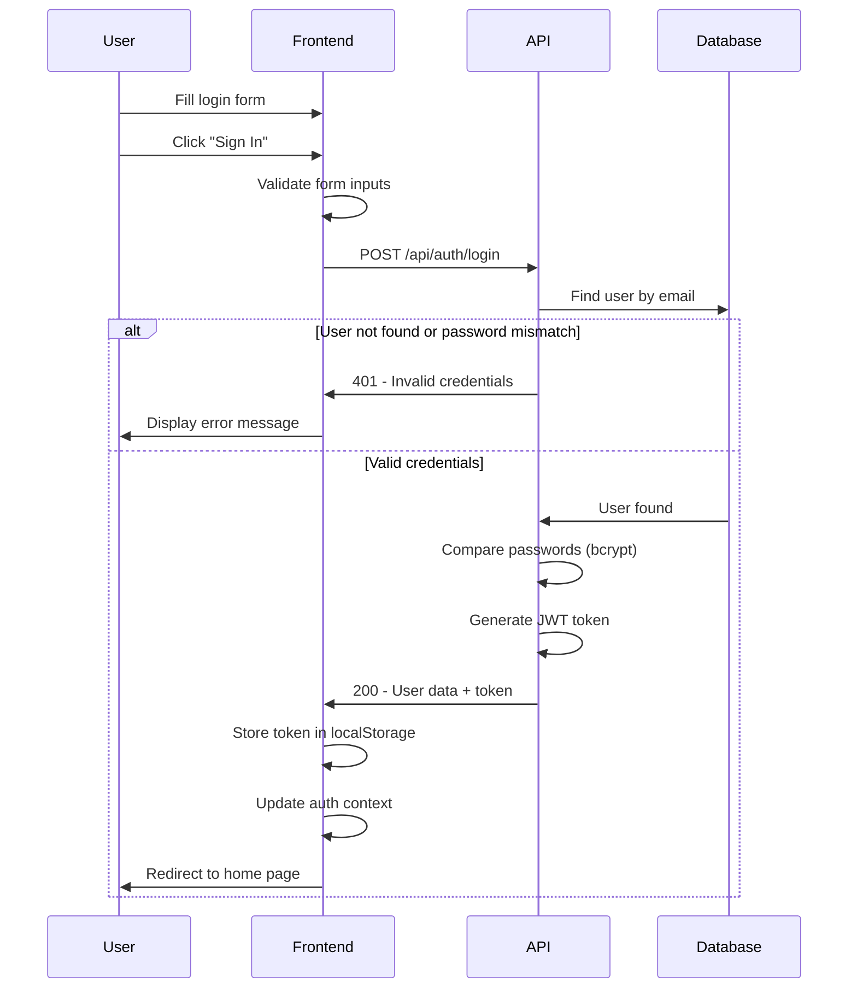
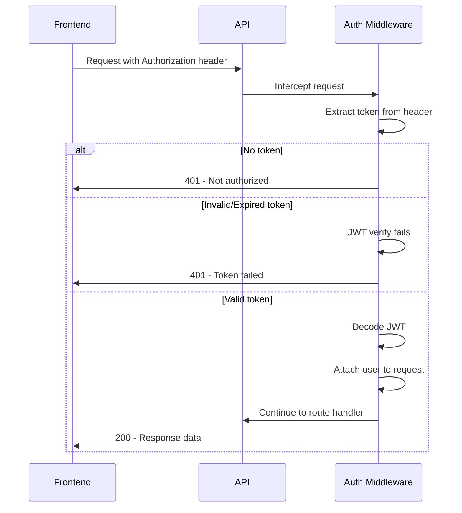
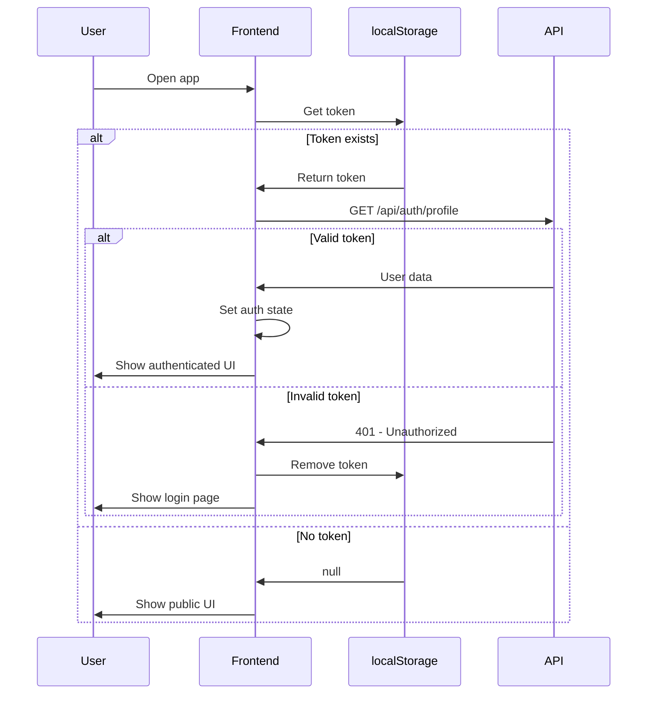

# Design Document - User Authentication System

## Overview

The user authentication system provides secure login and registration functionality for the RentalHub application. The backend is already fully implemented with Express.js, MongoDB/Mongoose, JWT, and bcrypt. The frontend has UI components but lacks API integration. This design focuses on connecting the existing frontend forms to the backend API and implementing proper authentication state management.

## Architecture

### High-Level Architecture

```
┌─────────────────┐         ┌─────────────────┐         ┌─────────────────┐
│   React         │  HTTP   │   Express       │         │   MongoDB       │
│   Frontend      │────────▶│   Backend       │────────▶│   Database      │
│   (Vite)        │  JSON   │   API           │         │                 │
└─────────────────┘         └─────────────────┘         └─────────────────┘
     │                              │
     │                              │
     ▼                              ▼
┌─────────────┐           ┌──────────────┐
│ localStorage│           │ JWT + bcrypt │
│ (Token)     │           │ Auth Layer   │
└─────────────┘           └──────────────┘
```

### Backend Architecture (Already Implemented)

The backend follows an MVC-like pattern:
- **Models**: User schema with bcrypt password hashing
- **Controllers**: authController handles registration and login logic
- **Routes**: authRoutes defines API endpoints
- **Middleware**: authMiddleware validates JWT tokens
- **Utils**: generateToken creates JWT tokens

### Frontend Architecture (To Be Implemented)

```
src/
├── pages/
│   ├── Login.jsx         (Update: Add API integration)
│   └── Register.jsx      (Update: Add API integration)
├── context/
│   └── AuthContext.jsx   (Create: Global auth state)
├── utils/
│   └── api.js           (Create: Axios configuration)
└── App.jsx              (Update: Add auth context provider)
```

## Components and Interfaces

### Backend API Endpoints (Already Implemented)

#### 1. Register Endpoint
- **URL**: `POST /api/auth/register`
- **Request Body**:
```json
{
  "name": "string (required)",
  "email": "string (required)",
  "password": "string (required)",
  "phone": "string (optional)"
}
```
- **Success Response** (201):
```json
{
  "_id": "string",
  "name": "string",
  "email": "string",
  "role": "string",
  "token": "string (JWT)"
}
```
- **Error Response** (400):
```json
{
  "message": "User already exists"
}
```

#### 2. Login Endpoint
- **URL**: `POST /api/auth/login`
- **Request Body**:
```json
{
  "email": "string (required)",
  "password": "string (required)"
}
```
- **Success Response** (200):
```json
{
  "_id": "string",
  "name": "string",
  "email": "string",
  "role": "string",
  "token": "string (JWT)"
}
```
- **Error Response** (401):
```json
{
  "message": "Invalid email or password"
}
```

#### 3. Get Profile Endpoint
- **URL**: `GET /api/auth/profile`
- **Headers**: `Authorization: Bearer {token}`
- **Success Response** (200):
```json
{
  "_id": "string",
  "name": "string",
  "email": "string",
  "phone": "string",
  "role": "string"
}
```
- **Error Response** (401):
```json
{
  "message": "Not authorized, no token"
}
```

### Frontend Components

#### 1. AuthContext (Context API)

**Purpose**: Manage global authentication state across the application

**State**:
```javascript
{
  user: {
    _id: string,
    name: string,
    email: string,
    role: string
  } | null,
  token: string | null,
  loading: boolean,
  error: string | null
}
```

**Methods**:
- `login(email, password)`: Authenticate user and store token
- `register(name, email, password, phone)`: Create new user account
- `logout()`: Clear token and user state
- `checkAuth()`: Verify token validity on app load

**Implementation Pattern**: Use React Context + useReducer for state management

#### 2. API Utility Module

**Purpose**: Centralized axios configuration with interceptors

**Features**:
- Base URL configuration (from environment variable)
- Request interceptor to attach JWT token to headers
- Response interceptor for error handling
- Authentication-specific API calls

**Example Structure**:
```javascript
const api = axios.create({
  baseURL: import.meta.env.VITE_API_URL || 'http://localhost:5000'
});

// Request interceptor
api.interceptors.request.use((config) => {
  const token = localStorage.getItem('token');
  if (token) {
    config.headers.Authorization = `Bearer ${token}`;
  }
  return config;
});

// Auth API methods
export const authAPI = {
  login: (credentials) => api.post('/api/auth/login', credentials),
  register: (userData) => api.post('/api/auth/register', userData),
  getProfile: () => api.get('/api/auth/profile')
};
```

#### 3. Updated Login Component

**Changes**:
- Import and use AuthContext
- Call API on form submission
- Handle loading and error states
- Redirect to home on successful login
- Display error messages from API

#### 4. Updated Register Component

**Changes**:
- Import and use AuthContext
- Call API on form submission
- Handle loading and error states
- Redirect to home on successful registration
- Display error messages from API

#### 5. Protected Route Wrapper

**Purpose**: Restrict access to authenticated users only

**Implementation**:
```javascript
const ProtectedRoute = ({ children }) => {
  const { user, loading } = useAuth();
  
  if (loading) return <div>Loading...</div>;
  if (!user) return <Navigate to="/login" />;
  
  return children;
};
```

## Data Models

### User Model (Already Implemented)

```javascript
{
  name: String (required),
  email: String (required, unique),
  password: String (required, hashed),
  phone: String (optional),
  role: String (enum: ['user', 'admin'], default: 'user'),
  timestamps: {
    createdAt: Date,
    updatedAt: Date
  }
}
```

**Key Features**:
- Password hashing via bcrypt (pre-save middleware)
- matchPassword method for authentication
- Password field excluded from JSON responses

### Frontend User State

```javascript
{
  _id: string,
  name: string,
  email: string,
  role: string,
  // Note: password never stored in frontend
}
```

### Token Storage

**Location**: localStorage
**Key**: 'token'
**Format**: JWT string
**Lifecycle**: 
- Set on login/register
- Removed on logout
- Checked on app initialization

## Error Handling

### Backend Error Responses (Already Implemented)

1. **Validation Errors** (400)
   - User already exists
   - Invalid user data

2. **Authentication Errors** (401)
   - Invalid credentials
   - Missing token
   - Invalid/expired token

3. **Not Found Errors** (404)
   - User not found

### Frontend Error Handling (To Be Implemented)

1. **Network Errors**
   - Display: "Unable to connect to server"
   - Action: Retry button

2. **API Errors**
   - Display: Server error message
   - Action: Show in form or toast notification

3. **Validation Errors**
   - Client-side validation before API call
   - Password minimum length (6 characters)
   - Email format validation

4. **Token Expiration**
   - Detect 401 responses
   - Clear token and redirect to login
   - Show message: "Session expired, please login again"

### Error Display Strategy

- Use state variable for error messages
- Display errors above form or in toast
- Clear errors on new form submission
- Auto-dismiss errors after 5 seconds (optional)

## Authentication Flow

### Registration Flow



### Login Flow



### Token Verification Flow



### App Initialization Flow



## Testing Strategy

### Backend Testing (Already Implemented)
The backend is functional and can be tested manually or with tools like Postman.

### Frontend Testing (To Be Implemented)

#### 1. Manual Testing Checklist

**Registration Tests**:
- [ ] Register with valid data succeeds
- [ ] Register with existing email shows error
- [ ] Register with short password shows validation error
- [ ] Register with invalid email shows validation error
- [ ] Successful registration redirects to home
- [ ] Token is stored in localStorage after registration

**Login Tests**:
- [ ] Login with valid credentials succeeds
- [ ] Login with invalid email shows error
- [ ] Login with wrong password shows error
- [ ] Successful login redirects to home
- [ ] Token is stored in localStorage after login

**Authentication State Tests**:
- [ ] Logged-in user sees profile link in navbar
- [ ] Logged-out user sees login/register links
- [ ] Token persists after page refresh
- [ ] Logout clears token and redirects to home
- [ ] Protected routes redirect to login when not authenticated
- [ ] Expired token is handled gracefully

#### 2. Integration Testing Priorities

Focus on critical user paths:
1. Complete registration → auto-login → access profile
2. Login → access protected route → logout
3. Token expiration → redirect to login
4. Network error handling

#### 3. Error Scenario Testing

Test all error paths:
- API unavailable (backend not running)
- Invalid credentials
- Duplicate email registration
- Token expiration
- Network timeout

### Testing Tools

- **Manual Testing**: Browser DevTools, Network tab
- **API Testing**: Postman or browser DevTools
- **State Inspection**: React DevTools for context state

## Security Considerations

### Backend Security (Already Implemented)

1. **Password Hashing**: bcrypt with salt (10 rounds)
2. **JWT Tokens**: Signed with secret, 30-day expiration
3. **Password Exclusion**: Never returned in API responses
4. **Input Validation**: Mongoose schema validation
5. **CORS**: Configured for cross-origin requests

### Frontend Security (To Be Implemented)

1. **Token Storage**: localStorage (acceptable for learning project)
2. **Input Sanitization**: HTML escaping by React (built-in)
3. **HTTPS**: Required in production
4. **Token Transmission**: Always via Authorization header
5. **Sensitive Data**: Never log tokens or passwords

### Security Best Practices

- Don't store sensitive data in state longer than needed
- Clear token on logout
- Validate token on protected routes
- Handle expired tokens gracefully
- Use environment variables for API URLs

## Environment Configuration

### Backend (.env file)

```env
PORT=5000
MONGO_URI=mongodb://localhost:27017/rentalhub
JWT_SECRET=your_jwt_secret_key_here
NODE_ENV=development
```

### Frontend (.env file)

```env
VITE_API_URL=http://localhost:5000
```

## Implementation Notes

### Key Design Decisions

1. **Context API over Redux**: Simpler for authentication-only state
2. **localStorage over cookies**: Easier to implement, suitable for learning
3. **Axios over fetch**: Better error handling and interceptors
4. **JWT in header**: Standard RESTful approach
5. **No refresh tokens**: Simplified for MVP, 30-day expiration

### Integration Points

1. **Navbar Component**: 
   - Update to show conditional links based on auth state
   - Show username when logged in
   - Add logout button

2. **Profile Page**:
   - Fetch user data from `/api/auth/profile`
   - Show loading state
   - Handle unauthorized access

3. **Protected Routes**:
   - Wrap admin dashboard in ProtectedRoute
   - Wrap profile page in ProtectedRoute

### Frontend File Structure

```
frontend/src/
├── context/
│   └── AuthContext.jsx          (NEW: Auth state management)
├── utils/
│   └── api.js                   (NEW: Axios config + API calls)
├── pages/
│   ├── Login.jsx                (UPDATE: API integration)
│   └── Register.jsx             (UPDATE: API integration)
├── components/
│   ├── Navbar.jsx               (UPDATE: Auth-aware UI)
│   └── ProtectedRoute.jsx       (NEW: Route guard)
└── App.jsx                      (UPDATE: Context provider)
```

## Dependencies

### Backend (Already Installed)
- express: Web framework
- mongoose: MongoDB ODM
- bcryptjs: Password hashing
- jsonwebtoken: JWT generation/validation
- cors: Cross-origin resource sharing
- dotenv: Environment variables

### Frontend (Already Installed)
- react: UI library
- react-dom: React DOM rendering
- react-router-dom: Client-side routing
- axios: HTTP client
- bootstrap: CSS framework

**Note**: All required dependencies are already installed. No additional packages needed.

## Deployment Considerations

### Backend
- Ensure JWT_SECRET is secure in production
- Use production MongoDB URI
- Enable HTTPS
- Configure CORS for production frontend URL

### Frontend
- Update VITE_API_URL to production API URL
- Build with `npm run build`
- Deploy static files to hosting service
- Enable HTTPS

## Future Enhancements (Out of Scope)

- Email verification
- Password reset functionality
- Refresh token implementation
- Social authentication (Google, Facebook)
- Remember me functionality
- Two-factor authentication
- Account deletion
- Profile picture upload
